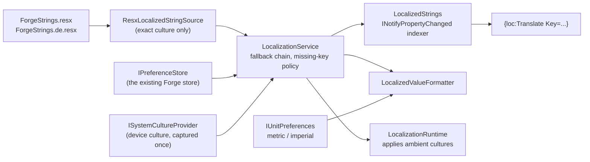

# Localization

Forge translates its interface through `.resx` resource files, resolves them through an
abstraction in `Forge.Core`, and switches language at runtime without restarting.

| Topic | Document |
| --- | --- |
| Add or change a string | [adding-a-string.md](adding-a-string.md) |
| Add a language | [adding-a-locale.md](adding-a-locale.md) |
| Convert the remaining screens | [full-conversion-runbook.md](full-conversion-runbook.md) |
| Right-to-left support | [rtl-readiness.md](rtl-readiness.md) |

## What is built today

The mechanism is complete and one screen uses it. The rest of the app still has literal strings
in XAML; converting them is a separate, sequential piece of work described in the runbook.

| Piece | Location |
| --- | --- |
| String keys, as compile-checked constants | `src/Forge.Core/Abstractions/Localization/ForgeStringKeys.cs` |
| Language catalogue and resolution rules | `src/Forge.Core/Abstractions/Localization/` |
| English and German strings | `src/Forge.App/Resources/Strings/` |
| Resource-file reader, XAML markup extension, culture applier | `src/Forge.App/Services/Localization/` |
| Language picker (the pilot screen) | `src/Forge.App/Features/Settings/Localization/` |
| Tests | `tests/Forge.Core.Tests/Localization/` |

## How it fits together

## The decisions worth knowing

**Keys live in `Forge.Core`, not in a generated designer class.** A designer class is only
reachable from `Forge.App`, and `Forge.App` targets Android and iOS, so no test project can
reference it. Putting the keys in the inner layer makes them testable, and
`ForgeStringResourcesTests` asserts an exact two-way match between the constants and the resource
files. That catches strictly more than a designer file does: a key with no string, a string with
no key, an untranslated entry, a blank value, and a translation that dropped a `{0}`.

**`Forge.App.Localization`, never `Forge.App.Resources`.** The accessor sits under
`Resources/Strings/` but declares the namespace `Forge.App.Localization`. A namespace called
`Forge.App.Resources` would shadow the `Resources` property every MAUI `VisualElement` exposes,
and a `global using` alias does not fix it. See the contributor instructions.

**The string source never falls back; the service does.** `ResourceManager.GetString(key,
culture)` walks parent cultures internally, which hides whether a string was genuinely translated
or merely inherited and buries the rule in a framework type no test can reach. Forge's source
answers only for the exact culture it was asked about, and `LocalizationService` owns the chain:
current culture, its parents, then the default language, ending at the invariant culture where
English lives.

**A missing string is never blank.** It renders as `!some.key!`. A blank label reads as a layout
bug, gets triaged as one, and can reach store review before anyone realises a string was never
added. Tests and tooling can opt into `MissingLocalizedStringBehavior.Throw`; the app does not,
because an untranslated label is a defect but not one worth crashing a workout over.

**Two cultures, not one.** `CurrentUICulture` chooses the translation and `CurrentCulture`
chooses date, number and separator conventions, mirroring the split the base class library makes.
A Swedish device gets English words - Forge has no Swedish - but keeps Swedish dates and a comma
decimal separator, because imposing American formatting on top would be a second, unrelated
insult.

**Language and units are independent settings.** The display language never touches
`IForgePreferences.UnitSystem`. A German lifter who trains in pounds and an American who trains
in kilograms both exist. `LocalizedValueFormatter` is the seam: the unit system decides *what* is
written (kg or lb), the culture decides *how* it is written (`82,5` or `82.5`). All four
combinations are covered by tests.

**Language is stored in the existing preference store.** Key
`forge.preferences.localization.language`, value either a language code or `system`. There is no
second settings file. The constant lives in `LocalizationPreferenceKeys` rather than in
`ForgePreferenceKeys` only so that adding a language does not edit a file that the Settings,
Backup and Profile streams all touch.

## Known gaps

- **`PreferenceBackup` does not include the language.** `PreferenceBackup.Export` enumerates
  `ForgePreferenceKeys` explicitly, so a restored backup keeps the device language rather than
  the user's choice. Adding `LocalizationPreferenceKeys.Language` to that document is a one-line
  change plus a schema-version bump, and belongs to whoever owns preference backup.
- **`UseDevExpress(useLocalization: false)`** in `MauiProgram.cs` still suppresses DevExpress's
  own localized strings. See [full-conversion-runbook.md](full-conversion-runbook.md#devexpress-localization).
- **`.AddLocalizationFeature()` is not yet wired** into `FeatureRegistration.AddForgeFeatures()`.
  Until it is, the language picker is unreachable and the app runs in English.
- **German needs a native-speaker pass.** Terms flagged for review are listed in
  [adding-a-locale.md](adding-a-locale.md#terms-flagged-for-review).
