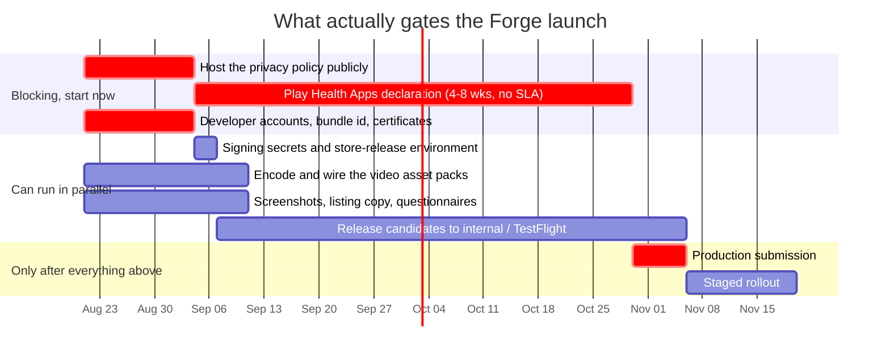

# Forge release runbook

How a Forge build gets from a git tag to a person's phone.

Read the first section before planning a launch date. The rest is a checklist you can follow
top to bottom.

---

## 1. The launch date is set by paperwork, not by code

The Google Play **Health Apps declaration** is required before an app that reads Health
Connect data can be published to production. Google's review has historically taken **four
to eight weeks**, and Google publishes **no SLA**. It cannot be escalated, paid for, or
compressed by writing code faster.

It also has a hard prerequisite: a **publicly hosted privacy policy URL**. The declaration
form asks for it, and the hosted text has to match the in-app policy. That page is owned by
the compliance stream, and until it is live the declaration cannot even be submitted.



Read that as: **the day the privacy policy goes live plus roughly two months is the earliest
possible production launch**, no matter how finished the app is.

Everything else in this runbook is designed around that fact. Release candidates ship to
internal testing and TestFlight the whole time - those tracks are deliberately *not* blocked
by the declaration - so engineering keeps validating on real devices while Google reviews.

`docs/release/launch-gates.yml` tracks the state of each of these. It is not decoration:
`tools/release/Invoke-ReleasePreflight.ps1` reads it and the publish jobs refuse to upload to
a scope whose gates are not approved.

---

## 2. One-time setup

Do this once, in this order. Steps 1 and 2 have external lead times; start them first.

1. **Register the developer accounts** and reserve `com.nikomix.forge` on both stores.
   Account verification can take up to two weeks. The identifier is permanent - it cannot be
   changed after the first published release without shipping a different app.
2. **Host the privacy policy.** Compliance stream. Replace the placeholder contact section in
   `docs/legal/privacy-policy.md` first. Then set `public-privacy-policy-url` to `approved`
   in `launch-gates.yml`.
3. **Start the Play Health Apps declaration** the same day the policy is live. Set the gate
   to `submitted`, and to `approved` only when Google confirms.
4. **Create the signing material** and add the secrets, following
   [`signing-and-secrets.md`](signing-and-secrets.md). Enrol in Play App Signing at the first
   upload.
5. **Create the `store-release` environment** in repository settings and add required
   reviewers. Both publish jobs use it, so nothing reaches a store without a human approving.
6. **Create `forge.pro.lifetime`** on both stores - a non-consumable on Apple, a managed
   product on Google. See `docs/store/README.md`.
7. **Complete the questionnaires**: Play Data safety, Apple App Privacy, and both age
   ratings. Answers are drafted in [`store-listing.md`](store-listing.md).
8. **Leave `FORGE_STORE_UPLOAD` unset** until a manual upload has succeeded once on each
   store. The first upload of a new app has account-level steps that no CI job can perform.

Update the matching gate in `launch-gates.yml` as each one completes. The file is the
handover artefact: it is what tells the next person what is actually done.

---

## 3. Video asset packs

Exercise video is **not** in the binary. It ships as store-hosted asset packs so the download
stays inside the 80-120 MB installed budget while the media grows independently.

The full mechanics are in [`../media/android-asset-delivery.md`](../media/android-asset-delivery.md)
and [`../media/ios-on-demand-resources.md`](../media/ios-on-demand-resources.md). What the
release flow needs from them:

| Platform | Names the app requests at runtime | Delivered by |
| --- | --- | --- |
| Android | `forge_video_standard`, `forge_video_high`, `forge_video_max` | Play Asset Delivery, on-demand |
| iOS | `forge-video-standard`, `forge-video-high`, `forge-video-max` | App Store On-Demand Resources |

These names are persisted in UI state and hard-coded in the platform services. A typo
produces an app that installs cleanly, passes every test, gets through store review, and
then fails the first time a real user taps "Download videos". Nothing in a build log tells
you.

So the release workflow checks the artefact itself:

* `tools/release/Test-AndroidAssetPacks.ps1` opens the `.aab` and asserts each pack is a
  module, then uses `bundletool` to assert the delivery type is on-demand rather than
  install-time.
* `tools/release/Test-IosOnDemandResources.ps1` searches the iOS build output for the three
  ODR tags.

Both **warn** on the build jobs and **fail** on a production publish. That is deliberate:
the packs are not in the repository yet, and engineering must still be able to produce a
test build.

**This needs an MSBuild change the release stream does not own** - see
[section 10](#10-project-changes-someone-else-must-make).

Publishing the packs themselves:

1. Encode the catalogue into three tiers. Keep each iOS tag under 512 MB while iOS 15-17 are
   supported.
2. Add the `AndroidAsset` / `BundleResource` item groups from the media docs.
3. Build a release candidate and confirm both verification steps report all three.
4. Upload the `.aab` to Play internal testing and confirm each pack shows as on-demand in the
   App Bundle Explorer.
5. Upload to TestFlight and confirm the ODR packs appear in App Store Connect.
6. Install from Play and from TestFlight - **not** a sideloaded APK or an Ad Hoc build - and
   download, cancel, remove and re-download each tier.

Only then set `video-asset-packs-published` to `approved`.

---

## 4. Cutting a release candidate

```powershell
# 1. Confirm the branch is green in CI.

# 2. Check what the tag will produce before creating it.
pwsh tools/release/Get-ReleaseVersion.ps1 -Tag v1.0.0-rc.1

# 3. See what would block a publish.
pwsh tools/release/Invoke-ReleasePreflight.ps1 -Tag v1.0.0-rc.1 -Platform All -Advisory

# 4. Tag and push.
git tag -a v1.0.0-rc.1 -m "Forge 1.0.0 release candidate 1"
git push origin v1.0.0-rc.1
```

The tag push starts the `Release` workflow. Tag grammar and the build-number scheme are in
[`versioning.md`](versioning.md). Get it wrong and the first job fails in seconds rather than
after two platform builds.

What runs:

| Job | Does | Fails the release? |
| --- | --- | --- |
| `version` | Resolves the tag, proves the scheme is still monotonic | Yes |
| `preflight` | Reports launch gates, secrets and listing lengths | No - advisory |
| `android` | Signed AAB, asset pack check, 90 MiB ceiling, R8 mapping | Yes |
| `ios` | Signed archive, ODR tag check, dSYMs | Yes |
| `publish-play` | Uploads to Play, blocking preflight first | Only if uploads are enabled |
| `publish-testflight` | Uploads to App Store Connect | Only if uploads are enabled |
| `github-release` | Draft GitHub release with the artefacts attached | Yes |

Publishing only happens when `FORGE_STORE_UPLOAD` is `enabled`, and then only after the
`store-release` environment approval.

Re-running the workflow on the same tag is safe: the build number comes from the tag, so it
reproduces the same build identity rather than burning a new one.

---

## 5. Pre-submission checks

Automated, on every release:

- [ ] Tag grammar and a monotonic build number (`version` job)
- [ ] Android bundle under the 90 MiB ceiling
- [ ] All three Play asset packs present and on-demand
- [ ] All three iOS ODR tags present
- [ ] Listing text within every store character limit, with no placeholder words
- [ ] R8 mapping and dSYMs captured - they cannot be regenerated later
- [ ] Every launch gate for the target scope approved (publish jobs only)

Manual, on a device installed **from the store**, not sideloaded:

- [ ] App launches from cold in under the agreed budget and does not crash on first run
- [ ] Onboarding can be skipped and the main tabs are reachable
- [ ] A workout can be started, logged and finished; the summary is correct
- [ ] Food, hydration and body metrics log and persist across a restart
- [ ] **Restore purchases** is present and works - Apple Guideline 3.1.1 rejects a
      non-consumable app without it
- [ ] Pro is **not** granted on a cancelled, pending-family-approval, or failed purchase
- [ ] Prices shown are the store-localised ones, never hard-coded
- [ ] **Delete my data** erases the database, key, cache and preferences, works offline, and
      does not open a support contact
- [ ] The in-app privacy policy matches the hosted policy word for word
- [ ] Health permissions are requested only at the point of use, with a rationale first
- [ ] Each video pack downloads, cancels, removes and re-downloads
- [ ] Backup export and import round-trips on a second device
- [ ] The medical disclaimer appears before any training or nutrition guidance
- [ ] Screenshots match screens that exist in this build

Anything in that second list that is false is a rejection risk, and a rejection costs another
review cycle - which on Google is measured in days and on Apple in an unpredictable number of
them.

---

## 6. Production submission

Only after `play-health-apps-declaration` is **approved**.

```powershell
pwsh tools/release/Invoke-ReleasePreflight.ps1 -Tag v1.0.0 -Platform All   # must pass, no -Advisory
git tag -a v1.0.0 -m "Forge 1.0.0"
git push origin v1.0.0
```

Google Play:

1. The `publish-play` job uploads to the production track at the staged rollout fraction and
   uploads the listing text from `fastlane/metadata/android`.
2. Confirm the release in Play Console. Screenshots and the feature graphic are uploaded by
   hand, once - CI never touches them.
3. Play review is typically hours to a few days for an established app, and longer for a
   first submission.

App Store:

1. The `publish-testflight` job uploads the archive. It lands in TestFlight.
2. Wait for processing, then submit for review from App Store Connect **by hand**. Promotion
   is deliberately manual: App Store review is not reversible and a phased release cannot be
   restarted.
3. Choose **Phased release for automatic updates** and **Manually release this version**, so
   the moment of going live is yours rather than the reviewer's.

---

## 7. Phased rollout

Ship to a fraction, watch, then widen. This is not caution theatre - on Google Play a staged
rollout is the *only* rollback that exists.

| Day | Google Play | App Store |
| --- | --- | --- |
| 0 | 10% (`FORGE_PLAY_ROLLOUT`, default `0.1`) | Phased release day 1: 1% |
| 1-2 | Hold. Watch crash rate and ANR rate. | Apple advances automatically: 2%, 5% |
| 3 | 20% if clean | 10% |
| 5 | 50% if clean | 20%, 50% |
| 7 | 100% | 100% |

What "clean" means, measured against the previous release, not against zero:

* crash-free sessions no worse than the previous version;
* Android ANR rate below Play's bad-behaviour threshold;
* no spike in one-star reviews naming a specific screen;
* no rise in Health Connect or purchase-restore failures.

Do not widen a rollout on a Friday. The people who would have to halt it are not there on
Saturday.

---

## 8. Halting and rolling back

**Neither store lets you un-ship a version.** Plan around that rather than hoping.

### Google Play

1. **Halt the rollout** in Play Console → Releases → the staged release → Halt. Users who
   already updated stay updated; nobody new receives it. This is the fast lever - use it
   first and diagnose afterwards.
2. To recover, ship a **new higher version**. Tag `v1.0.1-rc.1`, verify, then `v1.0.1`. You
   cannot re-publish `v1.0.0` content under the same build number, and Play remembers every
   build number it has accepted.
3. If a fix genuinely needs the same content as a rejected upload, use the re-upload suffix:
   `v1.0.0+1` produces build number `1000091` while keeping the display version `1.0.0`.

### App Store

1. If the version is in **phased release**, pause it in App Store Connect. Same trade-off as
   Play: already-updated users keep the build.
2. If it is fully released, **remove the version from sale** to stop new downloads, then ship
   a patch. Removing from sale does not downgrade anyone.
3. If the build is truly dangerous, request an **expedited review** for the fix. Apple grants
   these sparingly; spending one on a cosmetic bug means not having it for a real emergency.

### Both

4. Post the incident in the repository so the next release knows. If the cause was something
   a check could have caught, add the check - `tools/release/` exists for exactly that.

### Data is the part you cannot roll back

Forge is local-first: the device is the system of record and there is no server-side copy. A
release that corrupts or drops the local database has destroyed user data permanently. That
raises the bar on any release containing an EF Core migration:

* test the migration against a database restored from the previous version, not a fresh one;
* verify export-then-import round-trips across the migration;
* treat a migration release as production-critical even when the visible change is small.

---

## 9. Running pieces by hand

```powershell
# What will this tag produce?
pwsh tools/release/Get-ReleaseVersion.ps1 -Tag v1.0.0-rc.3

# Is the scheme still monotonic?
pwsh tools/release/Get-ReleaseVersion.ps1 -SelfTest

# What is blocking a publish?
pwsh tools/release/Invoke-ReleasePreflight.ps1 -Tag v1.0.0 -Platform All -Advisory

# Is the listing text within store limits?
pwsh tools/release/Test-StoreMetadata.ps1

# Does a bundle contain the video packs?
pwsh tools/release/Test-AndroidAssetPacks.ps1 -BundlePath artifacts/android

# What exactly would be uploaded? (prints the command, uploads nothing)
pwsh tools/release/Publish-StoreRelease.ps1 -Platform Android `
  -PackagePath artifacts/android -Track production -RolloutFraction 0.1 `
  -ServiceAccountJsonPath key.json -WhatIf
```

Building a signed bundle locally, when you need to reproduce a CI result:

```powershell
dotnet publish src/Forge.App/Forge.App.csproj -f net10.0-android -c Release `
  -p:AndroidPackageFormats=aab `
  -p:AndroidKeyStore=true `
  -p:AndroidSigningKeyStore=forge-upload.jks `
  -p:AndroidSigningStorePass=... `
  -p:AndroidSigningKeyAlias=forge-upload `
  -p:AndroidSigningKeyPass=... `
  -p:ApplicationDisplayVersion=1.0.0 `
  -p:ApplicationVersion=1000090 `
  -o artifacts/android
```

iOS archives need a Mac. The owner's MacBook Pro paired with Visual Studio works for
development builds; the release workflow's `macos-latest` runner is the reproducible path for
anything that will be submitted.

---

## 10. Project changes someone else must make

The release stream does not own `src/**`. These changes are required before a **production**
release and are described precisely so whoever owns those files can make them.

### 10.1 Android asset packs - `src/Forge.App/Forge.App.csproj`

Required for `video-asset-packs-published`. Add an Android-only item group, per
`docs/media/android-asset-delivery.md`:

```xml
<ItemGroup Label="Play Asset Delivery video packs"
           Condition="$([MSBuild]::GetTargetPlatformIdentifier('$(TargetFramework)')) == 'android'">
  <AndroidAsset Include="Media\Videos\Standard\**\*"
                Link="%(RecursiveDir)%(Filename)%(Extension)"
                AssetPack="forge_video_standard"
                DeliveryType="OnDemand" />
  <AndroidAsset Include="Media\Videos\High\**\*"
                Link="%(RecursiveDir)%(Filename)%(Extension)"
                AssetPack="forge_video_high"
                DeliveryType="OnDemand" />
  <AndroidAsset Include="Media\Videos\Max\**\*"
                Link="%(RecursiveDir)%(Filename)%(Extension)"
                AssetPack="forge_video_max"
                DeliveryType="OnDemand" />
</ItemGroup>
```

Until this exists, `Test-AndroidAssetPacks.ps1` reports all three packs missing - correctly.

### 10.2 iOS On-Demand Resources - `src/Forge.App/Forge.App.csproj`

Per `docs/media/ios-on-demand-resources.md`: iOS-only `BundleResource` items carrying
`ResourceTags` of `forge-video-standard` / `-high` / `-max`, plus empty
`OnDemandResourcesInitialInstallTags` and `OnDemandResourcesPrefetchOrder` so none of the
tiers is downloaded at install time.

### 10.3 Export compliance - `src/Forge.App/Platforms/iOS/Info.plist`

**This blocks automated TestFlight delivery**, so it matters more than it looks.

Every App Store Connect upload asks whether the app uses encryption. Forge does - the local
database is encrypted with SQLCipher. If `ITSAppUsesNonExemptEncryption` is not in
`Info.plist`, each uploaded build sits in App Store Connect marked **Missing Compliance** and
is not distributable until somebody answers the question by hand in the web UI. An automated
upload will appear to succeed and then quietly do nothing useful.

Declaring the key answers it once:

```xml
<key>ITSAppUsesNonExemptEncryption</key>
<false/>
```

`false` is the right value **only if** Forge's encryption is exempt under Apple's export
rules - encryption limited to protecting the user's own data on their own device generally
is. That is an export-compliance determination for the account holder, not a build setting,
and it is worth ten minutes with Apple's export compliance documentation before the value is
committed. If the answer turns out to be that the encryption is not exempt, the app needs an
ERN and the key should be `true` instead.

### 10.4 iPad support - decide, then be consistent

`Info.plist` declares `UIDeviceFamily` `1` and `2`, so the listing **supports iPad**. That
means App Store Connect requires a 13-inch iPad screenshot set, and a reviewer will run the
app on an iPad.

Either commit to that - test the iPad layout and capture iPad screenshots - or remove `2`
from `UIDeviceFamily`. Shipping a stretched phone layout to an iPad-declared listing is a
routine rejection.

### 10.5 Not required

`ApplicationVersion` and `ApplicationDisplayVersion` already flow from `Directory.Build.props`
and are overridable on the command line, which is exactly what the workflow does. **No
versioning change to any project file is needed.**

---

## 11. What has actually been verified

Being straight about this matters more than the runbook reading confidently.

**Verified on a real machine:**

| Thing | How |
| --- | --- |
| `dotnet build Forge.slnx --no-incremental` | 0 warnings, 0 errors |
| Release `dotnet publish -f net10.0-android -p:AndroidPackageFormats=aab` | Ran locally to completion, producing a real `.aab` |
| Tag-derived version stamping reaches the bundle | The merged release manifest carried `versionCode="1000001"` and `versionName="1.0.0"` from `-p:ApplicationVersion` / `-p:ApplicationDisplayVersion`, exactly what `v1.0.0-rc.1` resolves to |
| Release ABIs | The bundle contains only `arm64-v8a` and `armeabi-v7a`, as `Forge.App.csproj` intends |
| Signed-bundle selection | A signing publish emits **both** `com.nikomix.forge.aab` (64.49 MiB) and `com.nikomix.forge-Signed.aab` (64.69 MiB). Confirmed the workflow and the scripts now select the signed one and never a glob's first match |
| Version scheme monotonicity and tag rejection | `Get-ReleaseVersion.ps1 -SelfTest` - 13 increasing tags, 14 malformed tags rejected |
| `GITHUB_OUTPUT` contract between the version job and every other job | All seven keys written with correct values, `refs/tags/` prefix stripped |
| Listing text within store limits | `Test-StoreMetadata.ps1` - it caught a 171-character promotional text against a 170 limit |
| Asset pack detection, pass and fail paths | `Test-AndroidAssetPacks.ps1` against a synthetic AAB and against the real one |
| ODR tag detection, pass and fail paths | `Test-IosOnDemandResources.ps1` against a synthetic build output |
| Preflight gating, advisory and blocking | Blocking mode exits non-zero and names the Health Apps declaration and its unmet privacy-policy dependency |
| Upload command construction and secret redaction | `Publish-StoreRelease.ps1 -WhatIf` for both platforms |
| Workflow and gate YAML | Parsed; all six scripts parse clean |

**Worth knowing from that run:** the real release bundle is **64.7 MiB**, not the "about
45 MiB" that the comment in `ci.yml` estimates. It is comfortably under the 90 MiB ceiling,
but the headroom is about 25 MiB rather than 45 MiB, and no exercise video is in it yet. That
comment belongs to the CI stream, so it is reported here rather than edited.

Also: no `mapping.txt` was produced by the local release publish, so the workflow's mapping
step warns rather than failing. If Play crash symbolication matters, that needs R8 shrinking
turned on in the project - which the release stream does not own.

**Not verified, and why:**

| Thing | Blocked on |
| --- | --- |
| Android signing with the real upload keystore | No keystore exists yet |
| iOS build, archive, signing and `.ipa` production | Needs a Mac and a real distribution certificate |
| The keychain import sequence in the `ios` job | Same - it is the widely used form, but it has not run here |
| `fastlane supply` actually reaching Play | Needs the service account key and an app that exists in Play Console |
| `xcrun altool` actually reaching App Store Connect | Needs the API key and an app record |
| `bundletool` delivery-type assertion | Needs an AAB that contains real asset packs |
| Play and Apple review outcomes | Nobody can verify these in advance |

The first upload to each store will find something this runbook did not predict. That is
expected. When it does, fix it here in the same change as the workaround, so the next person
does not rediscover it.
