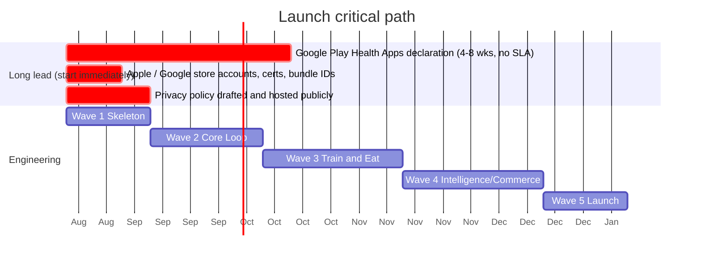

# Forge Implementation Roadmap

> Generated from `backlog/` — 32 epics, 161 features, 517 stories, 710 GitHub issues.

The roadmap is organised as **waves** (when) crossed with **domains** (who). A wave is a
horizon, not a sprint. Inside a wave, domains run in parallel.

## Why this shape

The hard constraint on parallel delivery is not people, it is **merge conflicts**. Two streams
that edit the same files cannot run at full speed no matter how many contributors exist.

So domains are drawn along file-ownership lines rather than along org-chart lines. Each domain
in `backlog/taxonomy.yml` declares the paths it owns, and features are assigned so that
concurrent streams touch disjoint folders. The feature-registration convention
(`AddXxxFeature()` per feature folder) exists for the same reason: it reduces the shared
surface in `MauiProgram.cs` to a single ordered list.

## The critical path is not code



**The single most important scheduling fact:** the Google Play Health Apps declaration, which
Health Connect read access requires, has historically taken **4 to 8 weeks** with no published
SLA. It depends on a publicly hosted privacy policy and an in-app permissions rationale screen.

If that paperwork starts at the end of the project it becomes the launch date. It is therefore
scheduled in **Wave 1** (epic E12), long before the code that consumes it. The same logic
applies to store accounts, bundle identifiers and certificates.

## Waves

| Wave | Milestone | Goal | Issues |
| --- | --- | --- | --- |
| 1 | W1 - Skeleton | An installable, themed, navigable app on both platforms with local storage and CI. No product features - this wave exists so that every later wave can run in parallel. | 120 |
| 2 | W2 - Core Loop | Onboard, set goals, browse exercises, see a profile. Design system and adaptive layout proven. | 169 |
| 3 | W3 - Train and Eat | The retention-critical loops end to end: build a plan and execute a workout; log food, macros and hydration. Notifications drive return visits. | 205 |
| 4 | W4 - Intelligence and Commerce | Health data flows in, analytics prove value, gamification retains, the shop monetises. First release-candidate scope. | 151 |
| 5 | W5 - Launch | Coaching, recovery, store assets, review hardening, submission. | 61 |
| 6 | W6 - Post-v1 | Explicitly out of scope, captured so intent is not lost. Includes the Windows and Mac Catalyst heads. | 4 |

## Domains

| Domain | Issues | Owns |
| --- | --- | --- |
| training | 108 | `Features/Exercises`, `Features/Plans`, `Features/Workout` |
| quality | 99 | `tests`, `.github/workflows`, `tools` |
| compliance | 91 | `Features/Settings`, `Features/Legal`, `Resources/Strings` |
| design | 75 | `Resources/Styles`, `Controls`, `Motion` |
| insights | 63 | `Features/Insights`, `Coaching` |
| nutrition | 63 | `Features/Nutrition`, `Features/Hydration` |
| identity | 47 | `Features/Identity`, `Features/Profile` |
| health | 46 | `Forge.Health`, `Features/Health` |
| data | 42 | `Persistence`, `Forge.Domain` |
| engagement | 42 | `Features/Engagement`, `Notifications` |
| commerce | 22 | `Features/Shop`, `Billing` |
| foundation | 12 | `Shell`, `Navigation`, `Abstractions` |

## Wave 1 — Skeleton

Wave 1 is deliberately unglamorous. Nothing here is a feature a user would name, and that is
the point: it is the wave that makes waves 2 to 5 parallelisable. It should be executed by a
small group, quickly, and not spread thin.

**Sequential spine (blocks everything):**

1. `S01.01.01` Solution structure with the compiler-enforced dependency rule
2. `S01.01.02` DevExpress registration and brand theme
3. `E04` Local data platform: EF Core, SQLCipher, migrations, seed import
4. `S01.02.01` Tab shell, `S01.02.02` typed navigation service

**Runs in parallel from day one:**

| Stream | Work |
| --- | --- |
| design | E02 design tokens, type scale, colour roles, component gallery |
| quality | E29 test scaffolding and architecture tests; E30 CI pipelines |
| health | **E12 Google Play Health declaration** - paperwork, not code, start now |
| compliance | E25 privacy policy drafting and public hosting |

## Waves 2 to 5 — parallel streams

Once Wave 1 lands, domains proceed largely independently. The coupling points worth watching:

| Coupling | Handling |
| --- | --- |
| Exercise library (E07) feeds plan builder (E09) and workout mode (E10) | E07 lands in Wave 2, a wave ahead of its consumers |
| Profile equipment and injuries (E06) filter exercises (E07) | Both in Wave 2; agree the contract first, build against it in parallel |
| Health data (E12) feeds analytics (E16) and readiness (E18) | E12 delivers the abstraction in Wave 1; consumers code against the interface |
| Design system (E02) underpins every screen | Wave 1, ahead of all feature UI |
| Notifications (E19) are used by hydration, workouts and streaks | E19 ships the infrastructure in Wave 3; callers register their own content |

## How to pick up work

```bash
# Ready work in the current wave for your domain
gh issue list --repo NikoMix/fitness --label "wave:2" --label "domain:training" --state open

# Everything blocking the launch date
gh issue list --repo NikoMix/fitness --label "concern:store-blocker" --state open

# Long-lead items that must not wait
gh issue list --repo NikoMix/fitness --label "concern:long-lead" --state open
```

Every issue carries its own requirements, testable acceptance criteria, implementation
direction and grounding links, so a contributor can start without reading this document first.
